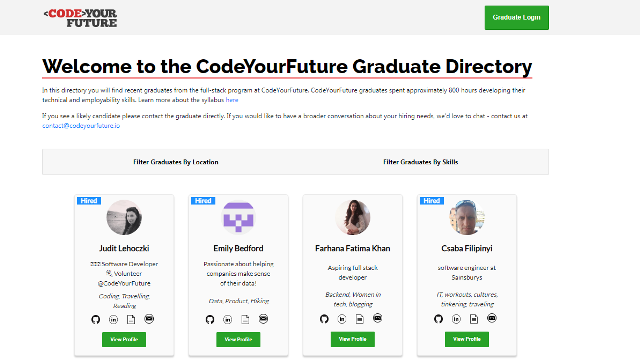
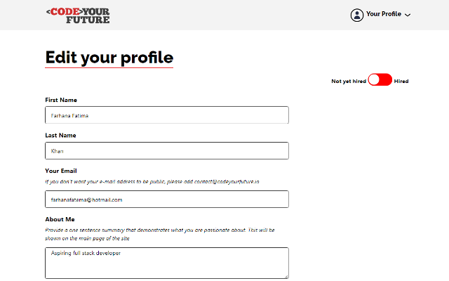
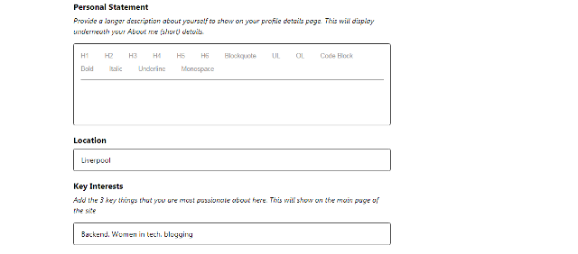
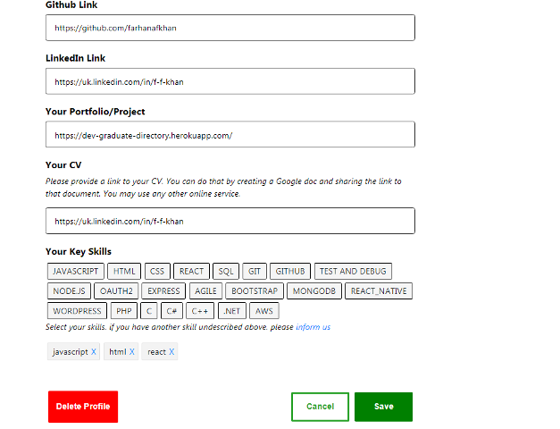

# Setup Project Locally 
 - clone repo
 - yarn install

# Entry points in the app to get started adding features:
 - Client folder ---> src contains all the front-end code.
 - Server Folder contains all the back-end code.

# Features
Graduate Directory aims to help CYF graduates get hired. 

- The platform allows graduates to publicise their profiles by logging in with their GitHub.
  The app uses Oauth2 authentication flow to sign in eligible CYF graduates. First time login takes the graduate to a form where they are prompted to fill in their details which are displayed on the overview as well as individual profile pages.
  Subsquent login shows graduate their profile which they can edit by selecting the Edit option in the dropdown menu at top right. 
  The graduate also has the option to delete their profile or change their employment status to 'Hired' which is also displayed on their card on the overview page.

- Potential employers can view the overview page and individual profile pages. They can also
  contact suitable candidates by directly sending an email.

- Mentors/Admin can login to the admin panel to add eligible GitHub usernames and skills.
  They can also send emails to graduates.    

 -  

 -  

 -  
 -  
 -  

## Scripts

Various scripts are provided in the package file, but many are helpers for other scripts; here are the ones you'll
commonly use:

 - `dev`: starts the frontend and backend in dev mode, with file watching (note that the backend runs on port 3100, and
    the frontend is proxied to it).
 - `lint`: runs ESLint against all the JavaScript in the project.
 - `serve`: builds and starts the app in production mode locally.

### Debugging

While running the dev mode using `npm run dev`, you can attach the Node debugger to the server process via port 9229.
If you're using VS Code, a debugging configuration is provided for this.

There is also a VS Code debugging configuration for the Chrome debugger, which requires the recommended Chrome
extension, for debugging the client application.

### Troubleshooting

See the guidance in the [wiki].

  [Babel]: https://babeljs.io/
  [Cloud Foundry]: https://www.cloudfoundry.org/
  [collaborators]: https://help.github.com/en/articles/inviting-collaborators-to-a-personal-repository
  [Docker]: https://www.docker.com
  [ESLint]: https://eslint.org/
  [Express]: https://expressjs.com/
  [Express router]: https://expressjs.com/en/guide/routing.html#express-router
  [Heroku]: https://www.heroku.com/
  [Heroku Postgres]: https://www.heroku.com/postgres
  [Node]: https://nodejs.org/en/
  [pull request]: https://help.github.com/en/articles/about-pull-requests
  [React]: https://reactjs.org/
  [Webpack]: https://webpack.js.org/
  [wiki]: https://github.com/textbook/starter-kit/wiki

### Packages
`yarn add react-bootstrap bootstrap`
`yarn add styled-components`
`yarn add formik yup`